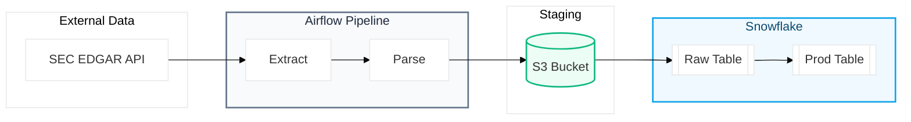

```mermaid
    %%{init: {'theme': 'base', 'themeVariables': { 'primaryColor': '#ffffff', 'edgeColor': '#666666' }}}%%
graph LR
    subgraph External_Sources [External Data]
        SEC[SEC EDGAR API]
    end

    subgraph Airflow_Orchestration [Airflow Pipeline]
        Extract[Extract]
        Parse[Parse]
    end

    subgraph Cloud_Storage [Staging]
        S3[(S3 Bucket)]
    end

    subgraph Data_Warehouse [Snowflake]
        RAW_TBL[[Raw Table]]
        PROD_TBL[[Prod Table]]
    end

    SEC --> Extract
    Extract --> Parse
    Parse --> S3
    S3 --> RAW_TBL
    RAW_TBL --> PROD_TBL

    %% Custom Modern Styling
    style Airflow_Orchestration fill:#f8fafc,stroke:#64748b,stroke-width:2px,color:#1e293b
    style Data_Warehouse fill:#f0f9ff,stroke:#0ea5e9,stroke-width:2px,color:#0c4a6e
    style S3 fill:#ecfdf5,stroke:#10b981,stroke-width:2px
```
