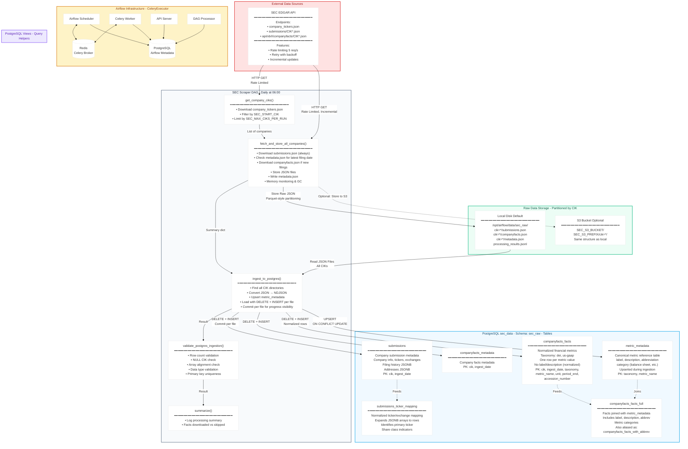

```mermaid
%%{init: {'theme': 'base', 'themeVariables': { 'primaryColor': '#ffffff', 'edgeColor': '#666666' }}}%%
graph TB
    subgraph External_Sources [External Data Sources]
        SEC["SEC EDGAR API<br/>━━━━━━━━━━━━━━━━━━━━━━━━━━━━━━<br/>Endpoints:<br/>• company_tickers.json<br/>• submissions/CIK*.json<br/>• api/xbrl/companyfacts/CIK*.json<br/>━━━━━━━━━━━━━━━━━━━━━━━━━━━━━━<br/>Features:<br/>• Rate limiting 5 req/s<br/>• Retry with backoff<br/>• Incremental updates"]
    end

    subgraph Airflow_Infrastructure [Airflow Infrastructure - CeleryExecutor]
        direction TB
        SCHEDULER[Airflow Scheduler]
        WORKER[Celery Worker]
        API[API Server]
        DAG_PROC[DAG Processor]

        POSTGRES_AF[(PostgreSQL<br/>Airflow Metadata)]
        REDIS[(Redis<br/>Celery Broker)]

        SCHEDULER --> POSTGRES_AF
        WORKER --> POSTGRES_AF
        API --> POSTGRES_AF
        DAG_PROC --> POSTGRES_AF
        WORKER <--> REDIS
        SCHEDULER <--> REDIS
    end

    subgraph Airflow_Pipeline [SEC Scraper DAG - Daily at 06:00]
        direction TB
        GET_CIKS["get_company_ciks()<br/>━━━━━━━━━━━━━━━━━━━━━━━━━━━━━━<br/>• Download company_tickers.json<br/>• Filter by SEC_START_CIK<br/>• Limit by SEC_MAX_CIKS_PER_RUN"]
        FETCH_STORE["fetch_and_store_all_companies()<br/>━━━━━━━━━━━━━━━━━━━━━━━━━━━━━━<br/>• Download submissions.json (always)<br/>• Check metadata.json for latest filing date<br/>• Download companyfacts.json if new filings<br/>• Store JSON files<br/>• Write metadata.json<br/>• Memory monitoring & GC"]
        INGEST["ingest_to_postgres()<br/>━━━━━━━━━━━━━━━━━━━━━━━━━━━━━━<br/>• Find all CIK directories<br/>• Convert JSON → NDJSON<br/>• Upsert metric_metadata<br/>• Load with DELETE + INSERT per file<br/>• Commit per file for progress visibility"]
        VALIDATE["validate_postgres_ingestion()<br/>━━━━━━━━━━━━━━━━━━━━━━━━━━━━━━<br/>• Row count validation<br/>• NULL CIK check<br/>• Array alignment check<br/>• Data type validation<br/>• Primary key uniqueness"]
        SUMMARIZE["summarize()<br/>━━━━━━━━━━━━━━━━━━━━━━━━━━━━━━<br/>• Log processing summary<br/>• Facts downloaded vs skipped"]

        GET_CIKS -->|List of companies| FETCH_STORE
        FETCH_STORE -->|Summary dict| INGEST
        INGEST -->|Result| VALIDATE
        VALIDATE -->|Result| SUMMARIZE
    end

    subgraph Storage [Raw Data Storage - Partitioned by CIK]
        direction LR
        LOCAL["Local Disk Default<br/>━━━━━━━━━━━━━━━━━━━━━━━━━━━━━━<br/>/opt/airflow/data/sec_raw/<br/>cik=*/submissions.json<br/>cik=*/companyfacts.json<br/>cik=*/metadata.json<br/>processing_results.jsonl"]
        S3["S3 Bucket Optional<br/>━━━━━━━━━━━━━━━━━━━━━━━━━━━━━━<br/>SEC_S3_BUCKET/<br/>SEC_S3_PREFIX/cik=*/<br/>Same structure as local"]
    end

    subgraph PG_Raw [PostgreSQL sec_data - Schema: sec_raw - Tables]
        direction TB
        SUBMISSIONS["submissions<br/>━━━━━━━━━━━━━━━━━━━━━━━━━━━━━━<br/>Company submission metadata<br/>Company info, tickers, exchanges<br/>Filing history JSONB<br/>Addresses JSONB<br/>PK: cik, ingest_date"]
        CF_METADATA["companyfacts_metadata<br/>━━━━━━━━━━━━━━━━━━━━━━━━━━━━━━<br/>Company facts metadata<br/>PK: cik, ingest_date"]
        CF_FACTS["companyfacts_facts<br/>━━━━━━━━━━━━━━━━━━━━━━━━━━━━━━<br/>Normalized financial metrics<br/>Taxonomy: dei, us-gaap<br/>One row per metric value<br/>No label/description (normalized)<br/>PK: cik, ingest_date, taxonomy,<br/>metric_name, unit, period_end,<br/>accession_number"]
        METRIC_META["metric_metadata<br/>━━━━━━━━━━━━━━━━━━━━━━━━━━━━━━<br/>Canonical metric reference table<br/>label, description, abbreviation<br/>category (balance sheet, etc.)<br/>Upserted during ingestion<br/>PK: taxonomy, metric_name"]

        SUBMISSIONS -.->|Feeds| VIEW1
        CF_FACTS -.->|Feeds| VIEW2
        METRIC_META -.->|Joins| VIEW2
    end

    subgraph PG_Views [PostgreSQL Views - Query Helpers]
        direction TB
        VIEW1["submissions_ticker_mapping<br/>━━━━━━━━━━━━━━━━━━━━━━━━━━━━━━<br/>Normalized ticker/exchange mapping<br/>Expands JSONB arrays to rows<br/>Identifies primary ticker<br/>Share class indicators"]
        VIEW2["companyfacts_facts_full<br/>━━━━━━━━━━━━━━━━━━━━━━━━━━━━━━<br/>Facts joined with metric_metadata<br/>Includes label, description, abbrev<br/>Metric categories<br/>Also aliased as:<br/>companyfacts_facts_with_abbrev"]
    end

    SEC -->|HTTP GET<br/>Rate Limited| GET_CIKS
    SEC -->|HTTP GET<br/>Rate Limited, Incremental| FETCH_STORE

    FETCH_STORE -->|Store Raw JSON<br/>Parquet-style partitioning| LOCAL
    FETCH_STORE -.->|Optional: Store to S3| S3

    LOCAL -->|Read JSON Files<br/>All CIKs| INGEST
    INGEST -->|DELETE + INSERT<br/>Commit per file| SUBMISSIONS
    INGEST -->|DELETE + INSERT| CF_METADATA
    INGEST -->|DELETE + INSERT<br/>Normalized rows| CF_FACTS
    INGEST -->|UPSERT<br/>ON CONFLICT UPDATE| METRIC_META

    %% Styling
    style External_Sources fill:#fee2e2,stroke:#dc2626,stroke-width:2px,color:#991b1b
    style Airflow_Infrastructure fill:#fef3c7,stroke:#d97706,stroke-width:2px,color:#92400e
    style Airflow_Pipeline fill:#f8fafc,stroke:#64748b,stroke-width:2px,color:#1e293b
    style Storage fill:#ecfdf5,stroke:#10b981,stroke-width:2px,color:#065f46
    style PG_Raw fill:#f0f9ff,stroke:#0ea5e9,stroke-width:2px,color:#0c4a6e
    style PG_Views fill:#ede9fe,stroke:#8b5cf6,stroke-width:2px,color:#5b21b6
```
