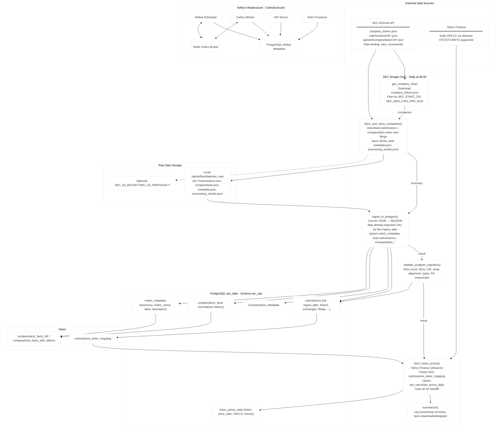

```mermaid
%%{init: {'theme': 'base', 'themeVariables': { 'primaryColor': '#ffffff', 'edgeColor': '#666666' }}}%%
graph TB
    subgraph External_Sources [External Data Sources]
        SEC["SEC EDGAR API<br/>━━━━━━━━━━━━━━━━━━━━━━━━━━━━━━<br/>company_tickers.json<br/>submissions/CIK*.json<br/>api/xbrl/companyfacts/CIK*.json<br/>Rate limiting, retry, incremental"]
        YAHOO["Yahoo Finance<br/>━━━━━━━━━━━━━━━━━━━━━━━━━━━━━━<br/>Daily OHLCV via yfinance<br/>OTC/OTCMKTS supported"]
    end

    subgraph Airflow_Infrastructure [Airflow Infrastructure - CeleryExecutor]
        direction TB
        SCHEDULER[Airflow Scheduler]
        WORKER[Celery Worker]
        API[API Server]
        DAG_PROC[DAG Processor]
        POSTGRES_AF[(PostgreSQL Airflow Metadata)]
        REDIS[(Redis Celery Broker)]
        SCHEDULER --> POSTGRES_AF
        WORKER --> POSTGRES_AF
        API --> POSTGRES_AF
        DAG_PROC --> POSTGRES_AF
        WORKER <--> REDIS
        SCHEDULER <--> REDIS
    end

    subgraph Airflow_Pipeline [SEC Scraper DAG - Daily at 06:00]
        direction TB
        GET_CIKS["get_company_ciks()<br/>Download company_tickers.json<br/>Filter by SEC_START_CIK, SEC_MAX_CIKS_PER_RUN"]
        FETCH_STORE["fetch_and_store_companies()<br/>Download submissions + companyfacts when new filings<br/>Store JSON, write metadata.json, processing_results.jsonl"]
        INGEST["ingest_to_postgres()<br/>Convert JSON → NDJSON<br/>Skip already-ingested CIKs for this ingest_date<br/>Upsert metric_metadata, load submissions / companyfacts_*"]
        VALIDATE["validate_postgres_ingestion()<br/>Row count, NULL CIK, array alignment, types, PK uniqueness"]
        FETCH_PRICES["fetch_ticker_prices()<br/>Yahoo Finance (yfinance)<br/>Tickers from submissions_ticker_mapping<br/>Upsert sec_raw.ticker_prices_daily<br/>Uses ds for backfill"]
        SUMMARIZE["summarize()<br/>Log processing summary, facts downloaded/skipped"]

        GET_CIKS -->|companies| FETCH_STORE
        FETCH_STORE -->|summary| INGEST
        INGEST -->|result| VALIDATE
        VALIDATE -->|result| FETCH_PRICES
        FETCH_PRICES --> SUMMARIZE
    end

    subgraph Storage [Raw Data Storage]
        LOCAL["Local: /opt/airflow/data/sec_raw/<br/>cik=*/submissions.json, companyfacts.json, metadata.json, processing_results.jsonl"]
        S3["Optional: SEC_S3_BUCKET/SEC_S3_PREFIX/cik=*/"]
    end

    subgraph PG_Raw [PostgreSQL sec_data - Schema sec_raw]
        SUBMISSIONS["submissions (cik, ingest_date, tickers, exchanges, filings, ...)"]
        CF_METADATA["companyfacts_metadata"]
        CF_FACTS["companyfacts_facts (normalized metrics)"]
        METRIC_META["metric_metadata (taxonomy, metric_name, label, description)"]
        TICKER_PRICES["ticker_prices_daily (ticker, price_date, OHLCV, source)"]
    end

    subgraph PG_Views [Views]
        VIEW1["submissions_ticker_mapping"]
        VIEW2["companyfacts_facts_full / companyfacts_facts_with_abbrev"]
    end

    SEC --> GET_CIKS
    SEC --> FETCH_STORE
    FETCH_STORE --> LOCAL
    FETCH_STORE -.-> S3
    LOCAL --> INGEST
    INGEST --> SUBMISSIONS
    INGEST --> CF_METADATA
    INGEST --> CF_FACTS
    INGEST --> METRIC_META
    VALIDATE --> SUBMISSIONS
    SUBMISSIONS --> VIEW1
    VIEW1 --> FETCH_PRICES
    YAHOO --> FETCH_PRICES
    FETCH_PRICES --> TICKER_PRICES
    CF_FACTS --> VIEW2
    METRIC_META --> VIEW2
```
